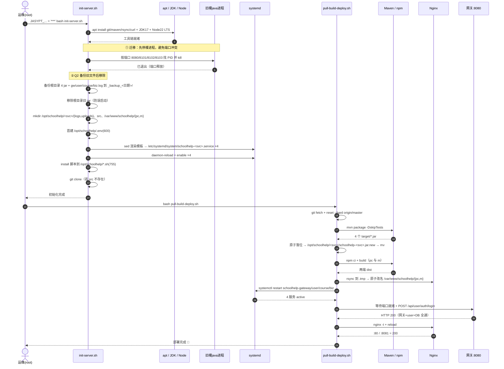
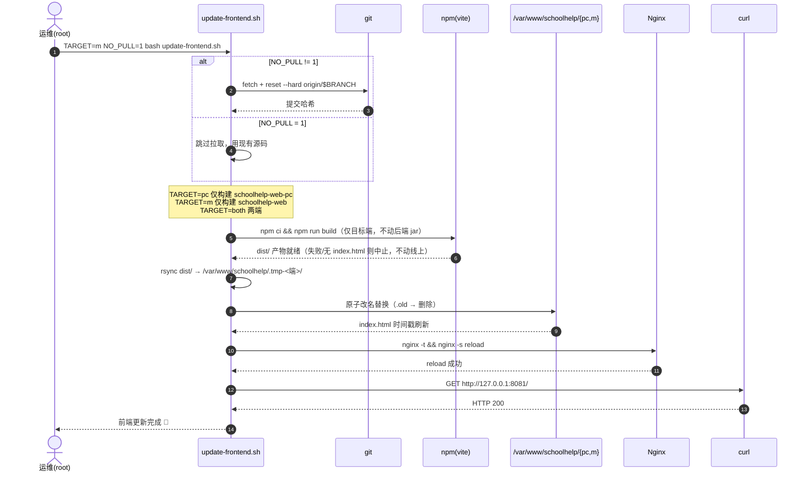
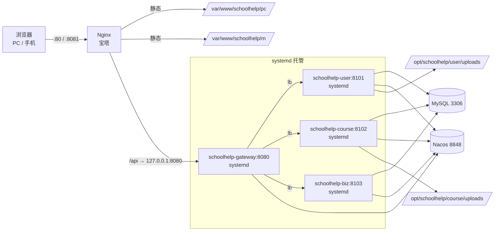

# schoolHelp 架构设计 + 任务分解 — 运维体系重构 + 增量上线

| 项 | 内容 |
|----|------|
| 文档类型 | 系统设计（Part A） + 任务分解（Part B） |
| 日期 | 2026-09-10 |
| 作者 | 高见远（架构师） |
| 关联 PRD | `docs/PRD-运维体系重构-20260910.md` |
| 目标环境 | 香港 Ubuntu `47.83.169.101`（**仅 IP 直连**，无域名/HTTPS/证书） |
| 本轮范围 | 配置层（B1/B2/logback）+ 运维脚本 + systemd + 增量上线；**不改业务逻辑** |
| 产出 | 新增 3 个文件、修改 8 个文件；任务 5 个 |

> 事实来源：本设计所有路径、行号、配置项均来自对仓库现有文件与 `deploy/` 脚本的实际读取，未作推测。已裁决事项（N1 目录、N2 日志、systemd、Q2 备份、Q3 脚本位置、本轮不改业务）直接采用。

---

## Part A：系统设计

### 1. 实现方案总览

#### 1.1 整体思路

本轮不新增业务能力，本质是**把"手工临时部署"升级为"可自启、可一键、可观测的标准部署"**，并顺带修复两处会带病上线的配置缺陷。落点收敛为四件事：

1. **目录规范化（N1）**：`jar + logs + uploads` 从根目录下沉到 `/opt/schoolhelp/<服务>/`，根目录只保留 `src/`、`sql/`、`.env`、`*.sh`、`_backup_*/`。
2. **进程托管化（systemd）**：4 个 `schoolhelp-<svc>.service`，`Restart=always` + `WantedBy=multi-user.target`，解决"裸进程随 SSH 会话消失、无自启"的致命隐患。
3. **日志框架化（N2 + B2 同批）**：`logback-spring.xml` 统一接管输出（`app.log` / `error.log` 分级滚动），并把 MyBatis 从 `System.out` 拉回 slf4j。
4. **配置外部化（B1）**：上传目录用 `${ENV:默认值}` 占位，服务器由 systemd 注入 Linux 绝对路径，本地默认值保持 Windows 路径不变 → **仓库里不出现服务器路径，本地开发零改动**。

#### 1.2 关键技术选型与取舍

| 决策点 | 选定方案 | 理由与取舍 |
|--------|----------|------------|
| **logback 组织方式** | **单份** `logback-spring.xml` 放在 `schoolhelp-common/src/main/resources/`，4 个模块共享 | ① 4 个模块都依赖 common，胖 jar 内 `BOOT-INF/lib/schoolhelp-common.jar` 是 classpath 的一部分，Spring Boot 的 `LoggingSystem` 能通过 `LaunchedClassLoader.getResources()` 在嵌套 jar 中找到 `logback-spring.xml`（这是 lib 内置日志配置的标准用法）。② **DRY**：滚动策略/保留天数只有一处，避免 4 份漂移。③ 各服务的差异（如 gateway 的 `logging.level.org.springframework.cloud.gateway`、SQL 日志级别）**已由各自 application.yml 的 `logging.level.*` 表达**，Spring Boot 会在 logback 配置之上叠加，故无需 4 份文件。**代价**：嵌套 jar 加载需实测一次（见 T01 验收 + 风险 R2），若异常回退为每模块各放一份（内容相同）。 |
| **日志文件路径** | logback 内 `${LOG_DIR:-logs/${spring.application.name}}`；**服务器由 systemd 注入 `-DLOG_DIR=/opt/schoolhelp/<svc>/logs`（绝对路径）** | ① 服务器用绝对路径 → **不依赖进程 CWD**，`WorkingDirectory` 配错也不丢日志。② 本地不注入 → 落到 `logs/<服务名>/`（相对路径），且**带服务名子目录**避免本地 4 服务共用 CWD 时互相覆盖同一 `app.log`。③ 用相对默认值 → **服务器路径不进仓库**。 |
| **B1 上传目录配置化** | `upload-dir: ${SCHOOLHELP_UPLOAD_DIR:<现有 Windows 绝对路径>}`；服务器 systemd `Environment=SCHOOLHELP_UPLOAD_DIR=/opt/schoolhelp/<svc>/uploads` | ① `${ENV:默认}` 让本地**默认值维持原样（US-5 零回归）**；② 服务器值由 systemd 注入 → 仓库无服务器路径；③ **不采用** `application-prod.yml`：那会把 `/opt/schoolhelp/...` 写进仓库，违反约束；④ 不用相对 `uploads`：会改变本地落盘位置（IDEA CWD 不定），有回归风险。 |
| **systemd 与日志的分工** | logback 的 **console appender → stdout**；systemd `StandardOutput=journal`、`StandardError=journal`（**不用 `append:`**） | ① 避免与 logback 自己写的 `app.log/error.log` **重复落盘/互相干扰**：文件日志由 logback 独占，stdout 走 journald。② `journalctl -u schoolhelp-<svc>` 保留"logback 初始化之前"的原始 stdout（banner、启动期异常栈），排障最有用；journald 自带轮转，无需额外文件。③ **禁止** `StandardOutput=append:$LOG_DIR/app.log`（会与 logback 双写）。 |
| **systemd 单元组织** | **1 个模板文件** `deploy/systemd/schoolhelp.service.tmpl`（占位符 `__SVC__/__JAVA_BIN__/__BASE__`），`init-server.sh` 用 `sed` 渲染成 4 个**具名** unit `schoolhelp-<svc>.service` | ① **不用 systemd 模板实例（`schoolhelp@.service`）**：实例名会是 `schoolhelp@gateway`，与 PRD 验收命令 `systemctl is-enabled schoolhelp-gateway ...` 不匹配。② 具名 unit 达成 DRY + 命名合规。 |
| **脚本改造方式** | **改造现有 6 个脚本**（不重写）：全部把 `APP=/opt/schoolhelp/app` 校正为 `BASE=/opt/schoolhelp` + 每服务 `$BASE/<svc>`；并新增**原子替换**与 `set -euo pipefail` | 现有脚本主体逻辑正确、已含阿里云/淘宝镜像与冒烟测试，重写是浪费；只需修正目录约定 + 提升部署原子性。**前端脚本**（`restart-frontend.sh`）不涉及 `APP`，仅需小幅加固。 |
| **打包失败恢复** | 后端 `install → *.jar.new → mv -f`（同目录 `mv` 为原子 rename）；前端 `rsync 到 .tmp-<端>/ → 原子改名替换`；全程 `set -euo pipefail`，**构建成功后才进入替换阶段** | 避免"半个产物"覆盖线上可用版本；`set -e` 让任一环节失败即中止，`npm run build` 因 vite 可能非零退出，故对其单独 `|| true` 并以"产物存在"为准（保留现有注释里的既有做法）。 |
| **前端更新粒度** | `TARGET=both|pc|m` + `NO_PULL=1` + `BRANCH` + `NPM_REGISTRY`（沿用现有接口，仅加固） | 接口已满足 US-4 三种粒度，无需新造。 |

---

### 2. 文件清单

#### 2.1 新增文件

| 相对路径 | 作用 | 变更类型 |
|----------|------|----------|
| `schoolhelp-common/src/main/resources/logback-spring.xml` | 全模块共享日志配置：CONSOLE + `app.log`(INFO+) + `error.log`(ERROR)；按天滚动、`LOG_RETENTION_DAYS` 默认 14 | 新增（`schoolhelp-common` 当前**无** `src/main/resources` 目录，需一并创建） |
| `deploy/systemd/schoolhelp.service.tmpl` | systemd 单元模板（占位符渲染为 4 个具名 unit） | 新增 |
| `docs/ARCH-运维体系重构-20260910.md` | 本设计文档 | 新增 |

#### 2.2 修改文件

| 相对路径 | 关键改动点（含现有行号） | 变更类型 |
|----------|--------------------------|----------|
| `schoolhelp-user/src/main/resources/application.yml` | L26 `log-impl` `StdOutImpl` → `Slf4jImpl`（B2）；L36 `upload-dir` → `${SCHOOLHELP_UPLOAD_DIR:D:/homework/schoolHelp/schoolHelp/schoolhelp-user/uploads}`（B1）；可选新增 `logging.level` 段 | 修改 |
| `schoolhelp-course/src/main/resources/application.yml` | L26 同 user（B2）；L30 `upload-dir` → `${SCHOOLHELP_UPLOAD_DIR:D:/homework/schoolHelp/schoolHelp/schoolhelp-course/uploads}`（B1） | 修改 |
| `schoolhelp-biz/src/main/resources/application.yml` | L28 `log-impl` → `Slf4jImpl`（B2，**无** upload-dir） | 修改 |
| `deploy/init-server.sh` | L12 删 `APP=$BASE/app`、改 `BASE`/`SRC`；L50 `mkdir` 改为逐服务建 `$BASE/<svc>/{logs,uploads}`；L67–92 systemd 段改为**读模板 + sed 渲染 + 备份/迁移旧文件 + 停裸进程**；新增"检测并停止裸 java 进程""备份根目录旧 jar/旧 log 到 `_backup_<日期>/`" | 修改（改动最大） |
| `deploy/restart-backend.sh` | L10 `APP=/opt/schoolhelp/app` → `BASE=/opt/schoolhelp`；L18–23 jar 存在性检查改为 `$BASE/$s/schoolhelp-$s.jar` | 修改 |
| `deploy/pull-build-deploy.sh` | L11 `set -uo pipefail` → `set -euo pipefail`；L13–16 去 `APP` 增 `BASE`；L50–60 组装路径改为 `$BASE/$s` + **原子替换**；L68–89 前端改为 **`.tmp` + 原子改名** | 修改 |
| `deploy/update-frontend.sh` | L11 `set -euo pipefail`（`npm build` 单独 `|| true`）；L37–53 前端部署改**原子替换**；参数接口保持不变 | 修改 |
| `deploy/restart-frontend.sh` | 逻辑不变（不涉 `APP`）；可选：新增 `nginx` 配置文件与 `deploy/nginx-schoolhelp.conf` 差异提示 | 修改（可选，低优先） |
| `deploy/README.md` | ① 全量把 `/opt/schoolhelp/app/` → `/opt/schoolhelp/<svc>/`；② 日志路径改为 `/opt/schoolhelp/<svc>/logs/{app,error}.log` + journald 说明；③ **删除 L60/L70 中明文 `JASYPT_ENCRYPTOR_PASSWORD`，改占位符**（见风险 R1） | 修改 |
| `start-all.ps1` | 建议 L57 `Start-Process` 增加 `-WorkingDirectory $root`；并在 `ArgumentList` 增 `"-DLOG_DIR=$logDir\$($svc.name)"`，使本地日志落入既有 `$logDir` 且按服务隔离（B1 无需改动，Windows 默认值仍生效） | 修改（可选，增强本地一致性） |

#### 2.3 删除文件

| 相对路径 | 说明 | 变更类型 |
|----------|------|----------|
| （无仓库内文件删除） | 服务器侧旧 jar / 旧 `*.log` 的移除属于**运行时迁移操作**（由 `init-server.sh` 备份后执行），不是仓库变更 | — |

---

### 3. 目录布局图（服务器最终结构）

```text
/opt/schoolhelp/                          # BASE（根：脚本 / 密钥 / 源码 / SQL / 备份）
├── .env                                  # 600，仅一行 JASYPT_ENCRYPTOR_PASSWORD=<口令>
├── .env.example                          # 可选：占位符示例（无真实口令）
├── init-server.sh                        # 755 一次性初始化
├── restart-backend.sh                    # 755 一键重启后端
├── restart-frontend.sh                   # 755 一键重启前端
├── pull-build-deploy.sh                  # 755 一键拉取+打包+部署
├── update-frontend.sh                    # 755 一键更新前端
├── sql/
│   ├── v1_*.sql  v2_*.sql  v3_user_approve_migration.sql
├── src/                                  # git clone 的仓库（mvn/npm 在此构建）
│   ├── .git/  pom.xml  schoolhelp-*/  schoolhelp-web*/  ...
├── _backup_20260910/                     # Q2：旧 jar + 旧 gw/user/course/biz.log 备份
│   ├── schoolhelp-gateway.jar ... biz.jar
│   └── gw.log  user.log  course.log  biz.log
├── gateway/
│   ├── schoolhelp-gateway.jar            # 唯一 jar 落点
│   └── logs/  app.log  error.log  app.<date>.log ...
├── user/
│   ├── schoolhelp-user.jar
│   ├── logs/  app.log  error.log ...
│   └── uploads/  avatar/                 # B1 目标（静态映射 /files/avatar/**）
├── course/
│   ├── schoolhelp-course.jar
│   ├── logs/  app.log  error.log ...
│   └── uploads/  material/               # B1 目标（静态映射 /files/material/**）
└── biz/
    ├── schoolhelp-biz.jar
    └── logs/  app.log  error.log ...

# —— 仓库（git）内 ——
schoolHelp/
├── schoolhelp-common/src/main/resources/logback-spring.xml   # 新增
├── deploy/
│   ├── init-server.sh  restart-backend.sh  restart-frontend.sh
│   ├── pull-build-deploy.sh  update-frontend.sh
│   ├── nginx-schoolhelp.conf
│   ├── README.md
│   └── systemd/schoolhelp.service.tmpl                       # 新增
└── docs/
    ├── PRD-运维体系重构-20260910.md
    ├── ARCH-运维体系重构-20260910.md                          # 本文
    └── sequence-diagram.mermaid                              # 新增

# —— Nginx 静态站（不变） ——
/var/www/schoolhelp/pc/    (80)     /var/www/schoolhelp/m/    (8081)
```

**布局约束（确认）**：`sql/`、`*.sh`、`.env`、`src/`、`_backup_*/` 留在 `/opt/schoolhelp/` 根；**只有 jar、`logs/`、`uploads/` 进入 `/opt/schoolhelp/<服务>/`**。

---

### 4. 数据结构与接口

#### 4.1 logback-spring.xml 关键元素（职责分工）

| 元素 | 类型 | 职责 | 关键参数 |
|------|------|------|----------|
| `springProperty APP_NAME` | Spring 扩展 | 从 `spring.application.name` 取服务名 | `source=spring.application.name`, `defaultValue=schoolhelp` |
| `property LOG_DIR` | 变量 | 日志目录 | `value=${LOG_DIR:-logs/${APP_NAME}}`（服务器 `-DLOG_DIR` 覆盖） |
| `property LOG_LEVEL` | 变量 | 根级别 | `value=${LOG_LEVEL:-INFO}` |
| `property LOG_RETENTION_DAYS` | 变量 | 保留天数（可配置项） | `value=${LOG_RETENTION_DAYS:-14}` |
| `CONSOLE` | `ConsoleAppender` | 控制台 → stdout（→ journald） | `encoder/pattern` |
| `APP_FILE` | `RollingFileAppender` | `app.log`，**INFO 及以上全量** | `file=${LOG_DIR}/app.log`；`ThresholdFilter level=INFO` |
| `ERROR_FILE` | `RollingFileAppender` | `error.log`，**仅 ERROR** | `file=${LOG_DIR}/error.log`；`LevelFilter level=ERROR onMatch=ACCEPT onMismatch=DENY` |
| `TimeBasedRollingPolicy` | 滚动策略 | 按天滚动 + 保留 | `fileNamePattern=${LOG_DIR}/app.%d{yyyy-MM-dd}.log`；`maxHistory=${LOG_RETENTION_DAYS}`；`totalSizeCap` |
| `root` | 根 logger | 装配三个 appender | `level=${LOG_LEVEL}` |

**关键片段示意**（工程师可直接照抄）：

```xml
<configuration>
  <springProperty scope="context" name="APP_NAME"
                  source="spring.application.name" defaultValue="schoolhelp"/>
  <property name="LOG_DIR"   value="${LOG_DIR:-logs/${APP_NAME}}"/>
  <property name="LOG_LEVEL" value="${LOG_LEVEL:-INFO}"/>
  <property name="RETENTION" value="${LOG_RETENTION_DAYS:-14}"/>
  <property name="PATTERN"
            value="%d{yyyy-MM-dd HH:mm:ss.SSS} [%thread] %-5level %logger{40} - %msg%n"/>

  <appender name="CONSOLE" class="ch.qos.logback.core.ConsoleAppender">
    <encoder><pattern>${PATTERN}</pattern><charset>UTF-8</charset></encoder>
  </appender>

  <appender name="APP_FILE" class="ch.qos.logback.core.rolling.RollingFileAppender">
    <file>${LOG_DIR}/app.log</file>
    <rollingPolicy class="ch.qos.logback.core.rolling.TimeBasedRollingPolicy">
      <fileNamePattern>${LOG_DIR}/app.%d{yyyy-MM-dd}.log</fileNamePattern>
      <maxHistory>${RETENTION}</maxHistory>
      <totalSizeCap>1GB</totalSizeCap>
    </rollingPolicy>
    <encoder><pattern>${PATTERN}</pattern><charset>UTF-8</charset></encoder>
    <filter class="ch.qos.logback.classic.filter.ThresholdFilter"><level>INFO</level></filter>
  </appender>

  <appender name="ERROR_FILE" class="ch.qos.logback.core.rolling.RollingFileAppender">
    <file>${LOG_DIR}/error.log</file>
    <rollingPolicy class="ch.qos.logback.core.rolling.TimeBasedRollingPolicy">
      <fileNamePattern>${LOG_DIR}/error.%d{yyyy-MM-dd}.log</fileNamePattern>
      <maxHistory>${RETENTION}</maxHistory>
      <totalSizeCap>512MB</totalSizeCap>
    </rollingPolicy>
    <encoder><pattern>${PATTERN}</pattern><charset>UTF-8</charset></encoder>
    <filter class="ch.qos.logback.classic.filter.LevelFilter">
      <level>ERROR</level><onMatch>ACCEPT</onMatch><onMismatch>DENY</onMismatch>
    </filter>
  </appender>

  <root level="${LOG_LEVEL}">
    <appender-ref ref="CONSOLE"/>
    <appender-ref ref="APP_FILE"/>
    <appender-ref ref="ERROR_FILE"/>
  </root>
</configuration>
```

> 注意：`<springProperty>` 必须在引用 `${APP_NAME}` 的 `<property>` 之前声明。

#### 4.2 application.yml 改动（精确 diff）

```yaml
# ---- schoolhelp-user / schoolhelp-course ----
mybatis-plus:
  configuration:
    map-underscore-to-camel-case: true
    log-impl: org.apache.ibatis.logging.slf4j.Slf4jImpl      # B2：原 StdOutImpl

schoolhelp:
  file:
    # B1：服务器由 systemd 注入 SCHOOLHELP_UPLOAD_DIR；本地用默认 Windows 路径
    upload-dir: ${SCHOOLHELP_UPLOAD_DIR:D:/homework/schoolHelp/schoolHelp/schoolhelp-user/uploads}
    base-url: /files
```
```yaml
# ---- schoolhelp-biz（仅 B2，无 upload-dir）----
mybatis-plus:
  configuration:
    map-underscore-to-camel-case: true
    log-impl: org.apache.ibatis.logging.slf4j.Slf4jImpl
```
```yaml
# ---- 可选：需要临时看 SQL 时（默认不写，靠 root=INFO 抑制 DEBUG）----
logging:
  level:
    com.schoolhelp.<module>.mapper: info    # 排查 SQL 时改 debug
```

#### 4.3 systemd 单元（模板 + 渲染结果字段）

`deploy/systemd/schoolhelp.service.tmpl`（占位符：`__SVC__` / `__JAVA_BIN__` / `__BASE__`）：

```ini
[Unit]
Description=schoolHelp __SVC__ service
After=network-online.target
Wants=network-online.target
StartLimitIntervalSec=0

[Service]
Type=simple
User=root
WorkingDirectory=__BASE__/__SVC__
EnvironmentFile=-__BASE__/.env
Environment=SCHOOLHELP_UPLOAD_DIR=__BASE__/__SVC__/uploads
ExecStart=__JAVA_BIN__ -Xms128m -Xmx512m -DLOG_DIR=__BASE__/__SVC__/logs -jar __BASE__/__SVC__/schoolhelp-__SVC__.jar
SuccessExitStatus=143
Restart=always
RestartSec=5
StandardOutput=journal
StandardError=journal
SyslogIdentifier=schoolhelp-__SVC__

[Install]
WantedBy=multi-user.target
```

| 字段 | 取值 | 说明 |
|------|------|------|
| `Description` | `schoolHelp <svc> service` | 具名 unit |
| `After/Wants` | `network-online.target` | 比 `network.target` 更晚，降低注册 Nacos 失败概率 |
| `StartLimitIntervalSec=0` | 0 | 关闭启动频率限制，**保证重启后无限重试** |
| `WorkingDirectory` | `/opt/schoolhelp/<svc>` | jar 同目录 |
| `EnvironmentFile` | `-/opt/schoolhelp/.env` | 前导 `-`：文件缺失不报错；注入 `JASYPT_ENCRYPTOR_PASSWORD` |
| `Environment` | `SCHOOLHELP_UPLOAD_DIR=...` | **仅 user/course 生效**；对 gateway/biz 无害（不消费该属性） |
| `ExecStart` | `java -DLOG_DIR=... -jar ...` | `-DLOG_DIR` 优先级最高，覆盖 logback 默认 |
| `Restart` | `always` | 崩溃/异常退出均拉起（`systemctl stop` 仍可正常停止） |
| `SuccessExitStatus=143` | 143 | SIGTERM(15)+128，优雅停机视为成功，避免误判失败重启 |
| `StandardOutput/Error` | `journal` | **与 logback 文件日志分工**，不双写 |
| `SyslogIdentifier` | `schoolhelp-<svc>` | `journalctl -u` / `-t` 可读 |

#### 4.4 脚本命令行参数接口（跨脚本统一约定）

| 脚本 | 参数（环境变量） | 取值 | 默认 | 作用 |
|------|------------------|------|------|------|
| `init-server.sh` | `JASYPT_ENCRYPTOR_PASSWORD` | 40 位口令 | 无（必填） | 写 `.env`（仅首次） |
| | `REPO_URL` / `BRANCH` | URL / 分支 | 仓库地址 / `master` | clone 源 |
| `restart-backend.sh` | （无） | — | — | 重启 4 服务 + 端口就绪 + 登录冒烟 |
| `restart-frontend.sh` | （无） | — | — | `nginx -t` + reload + `:80/:8081` 状态码 |
| `pull-build-deploy.sh` | `BRANCH` | 分支 | `master` | 拉取分支 |
| | `SKIP_BACKEND` / `SKIP_FRONTEND` | `1` 跳过 | 不跳过 | 部分部署 |
| | `MAVEN_MIRROR` / `NPM_REGISTRY` | URL | 阿里云 / 淘宝 | 加速 |
| `update-frontend.sh` | `TARGET` | `both`\|`pc`\|`m` | `both` | **更新粒度**（对应 PC/移动/两端） |
| | `NO_PULL` | `1` 不拉码 | 拉码 | 仅用现有源码构建 |
| | `BRANCH` / `NPM_REGISTRY` | 同上 | `master` / 淘宝 | — |

**退出码约定**：`0` 成功；非 `0` 失败。脚本统一输出 `[ok]`(绿)/`[err]`(红)/`[init|deploy|backend|frontend]` 前缀，便于人工与 `grep` 判读。

---

### 5. 调用流程（时序图）

#### 5.1 首次 / 迁移部署全流程（含"停裸进程 → 装 unit → 起服务 → 验端口"）



#### 5.2 日常"一键更新前端"流程（TARGET 粒度 + 原子替换）



---

## Part B：任务分解

> **说明**：本项目为**运维/配置重构**，不是新建应用，故按"配置基座 → 服务器引导 → 运维脚本 → 文档对齐 → 上线验收"五个**功能层次**分组（共 5 个任务，符合上限），组内多文件并行，尽量只依赖 T01/T02，避免长线性链。

### 6. 任务列表（按实现顺序）

#### T01 —— 日志与配置基座（logback 共享 + B1/B2 配置化）　【P0】

| 项 | 内容 |
|----|------|
| **涉及文件** | `schoolhelp-common/src/main/resources/logback-spring.xml`（新增；并创建 `src/main/resources/` 目录）<br/>`schoolhelp-user/src/main/resources/application.yml`（L26 B2、L36 B1）<br/>`schoolhelp-course/src/main/resources/application.yml`（L26 B2、L30 B1）<br/>`schoolhelp-biz/src/main/resources/application.yml`（L28 B2） |
| **前置依赖** | 无 |
| **实现要点** | ① 按 4.1 片段写 `logback-spring.xml`；② 三个 `application.yml` 按 4.2 diff 改；③ `schoolhelp-common` 目前无 resources 目录，需新建；④ gateway 的 `application.yml` **无需改动**（无 mybatis、无 upload-dir） |
| **验收方式** | `mvn -q -DskipTests clean package` 通过；`unzip -l schoolhelp-user/target/schoolhelp-user.jar \| grep -E 'logback-spring\\|logback.*common'` 能定位到共享配置；本地跑 user 模块 → 生成 `logs/<服务名>/app.log` 与 `error.log`；`grep -c 'Preparing:' logs/**/app.log` 不因默认级别刷新 SQL；本地头像上传成功且落在原 Windows 目录 |
| **复杂度** | M |

#### T02 —— 服务器引导与 systemd（模板 + init-server.sh）　【P0】

| 项 | 内容 |
|----|------|
| **涉及文件** | `deploy/systemd/schoolhelp.service.tmpl`（新增）<br/>`deploy/init-server.sh`（L12、L50、L67–92 重写；新增迁移/备份/停裸进程步骤） |
| **前置依赖** | T01（unit 注入的 `-DLOG_DIR`、`SCHOOLHELP_UPLOAD_DIR` 必须与 T01 配置一致） |
| **实现要点** | ① 模板见 4.3，占位 `__SVC__/__JAVA_BIN__/__BASE__`；② `init-server.sh` 用 `sed` 渲染为 `schoolhelp-<svc>.service` 并 `enable`；③ **新增步骤：按端口 8080/8101/8102/8103 找出裸 `java` 进程并停止**；④ **新增步骤：把根目录 4 jar + `gw/user/course/biz.log` 备份到 `_backup_<日期>/` 后移除**（Q2）；⑤ 逐服务 `mkdir -p $BASE/<svc>/{logs,uploads}`；⑥ 保持幂等（`.env` 已存在则跳过） |
| **验收方式** | 服务器实测：`systemctl is-enabled schoolhelp-gateway schoolhelp-user schoolhelp-course schoolhelp-biz` 全部 `enabled`；`ls /opt/schoolhelp/*.jar` 返回 No such file；`ls /opt/schoolhelp/_backup_*/` 含旧 jar 与旧 log；`reboot` 后不干预，`ss -ltnp \| grep -E ':8080\|:8101\|:8102\|:8103'` 4 端口均在监听 |
| **复杂度** | M |

#### T03 —— 运维脚本 N1 校正 + 原子替换　【P0】

| 项 | 内容 |
|----|------|
| **涉及文件** | `deploy/restart-backend.sh`（L10、L18–23）<br/>`deploy/pull-build-deploy.sh`（L11、L13–16、L50–60、L68–89）<br/>`deploy/update-frontend.sh`（L11、L37–53）<br/>`deploy/restart-frontend.sh`（可选加固） |
| **前置依赖** | T01（jar 落点 `$BASE/<svc>`）、T02（unit 已存在，重启才有意义） |
| **实现要点** | ① 四脚本一律去 `APP=/opt/schoolhelp/app`，改 `BASE=/opt/schoolhelp` + 每服务 `$BASE/<svc>`；② `pull-build-deploy.sh` 后端 `install → *.jar.new → mv -f`、前端 `rsync → .tmp-<端> → 原子改名`；③ `set -euo pipefail`（`npm run build` 单独 `|| true` + 校验 `dist/index.html`）；④ `restart-backend.sh` jar 校验路径改 `$BASE/$s/schoolhelp-$s.jar`；⑤ `update-frontend.sh` 保留 `TARGET/NO_PULL/BRANCH/NPM_REGISTRY` 接口 |
| **验收方式** | `grep -rn '/opt/schoolhelp/app' deploy/` 结果为空；`bash -n` 三个脚本语法通过（若装 `shellcheck` 则一并通过）；服务器 `TARGET=m bash /opt/schoolhelp/update-frontend.sh` 只刷新 `/var/www/schoolhelp/m/index.html` 且**不触发** Maven；`bash /opt/schoolhelp/pull-build-deploy.sh` 后 4 jar 时间戳刷新、`/api` 登录 200 |
| **复杂度** | M |

#### T04 —— 文档对齐与本地开发一致性　【P1】

| 项 | 内容 |
|----|------|
| **涉及文件** | `deploy/README.md`（路径 `/app/`→`/<svc>/`；日志说明；**移除 L60/L70 明文口令**）<br/>`README.md`（根，涉部署章节同步）<br/>`start-all.ps1`（L57 增 `-WorkingDirectory $root` + `-DLOG_DIR=$logDir\<svc>`）<br/>`docs/ARCH-运维体系重构-20260910.md`（本文件） |
| **前置依赖** | T01、T02、T03（文档需与最终路径/参数一致） |
| **实现要点** | ① 文档中所有 `/opt/schoolhelp/app` 清零；② 依赖包清单（见第 7 节）写入 `deploy/README.md`，回答"需要上传哪些依赖包、放哪"；③ **删除明文 `JASYPT_ENCRYPTOR_PASSWORD`，改 `JASYPT_ENCRYPTOR_PASSWORD='<在此填写40位口令>'`**（对应风险 R1）；④ `start-all.ps1` 仅为本地日志隔离，不改变启动逻辑（B1 默认 Windows 路径仍生效，本地零回归） |
| **验收方式** | `grep -rn 'JASYPT_ENCRYPTOR_PASSWORD' deploy/README.md` 仅出现占位符、无 40 位明文；`grep -rn '/opt/schoolhelp/app' deploy/ README.md` 为空；本地 `\.\start-all.ps1` 4 端口就绪、`logs/<svc>/app.log` 生成 |
| **复杂度** | S |

#### T05 —— 上线联调与验收　【P0】

| 项 | 内容 |
|----|------|
| **涉及文件** | `deploy/smoke-verify.sh`（新增，一次性把第 9 节验收命令固化为可执行清单）<br/>`deploy/README.md`（补验收命令小节）<br/>`docs/ARCH-运维体系重构-20260910.md`（回填验收结果） |
| **前置依赖** | T01、T02、T03、T04 |
| **实现要点** | ① 在服务器执行 `init-server.sh` → `pull-build-deploy.sh`；② 跑 PRD §5 全部验收（登录 200 / 无 token 401 / `:80`+`:8081` 200 / 4 端口监听 / 新 `index.html` 含 `force_pc` 且约 2043B / `:8081` 含 `force_mobile`）；③ 执行需求④ 班长审批全链路（注册→403→审批→200）；④ 校验 B1：上传头像后 `ls /opt/schoolhelp/user/uploads/avatar/` 有新文件、`ls -d /opt/schoolhelp/D*` 不存在；⑤ 校验 N2：`ls /opt/schoolhelp/<svc>/logs/` 见 `app.log` + `error.log` |
| **验收方式** | `deploy/smoke-verify.sh` 全绿退出（exit 0）；`curl -s http://47.83.169.101/ \| grep -c force_pc` ≥ 1；`curl -s http://47.83.169.101:8081/ \| grep -c force_mobile` ≥ 1；审批链路 6 步全部符合 PRD §5.6 |
| **复杂度** | M |

### 7. 依赖包列表

| 类型 | 包 | 安装位置 | 获取方式 | 是否需人工上传 |
|------|----|----------|----------|----------------|
| **系统包(apt)** | `git` `maven` `rsync` `curl` `ca-certificates` | 系统路径 | `init-server.sh` 内 `apt-get install -y` | 否 |
| 系统包(apt) | `openjdk-17-jdk`（JDK17） | `/usr/lib/jvm/...` | 同上（缺失时安装） | 否 |
| 系统包(NodeSource) | `nodejs` 22 LTS（`^20.19.0 \|\| >=22.12.0`） | `/usr/bin/node` | NodeSource setup_22.x 脚本 | 否 |
| **Maven 依赖** | 各 `pom.xml` 依赖（含 MyBatis-Plus/Jasypt/Nacos 等） | `/root/.m2/repository`（首次 200–400MB） | `mvn` 自动下载（阿里云镜像） | **否**（不入库、不上传） |
| **npm 依赖** | `schoolhelp-web/`、`schoolhelp-web-pc/` 的 `package.json` | 各 `node_modules/`（各 110–150MB） | `npm install`（淘宝镜像） | **否** |
| 运行时依赖 | MySQL 驱动等 | 已打进 fat jar | 随 jar 分发 | 否 |
| **无新增** | 本轮**不引入任何新的 Maven / npm 依赖** | — | — | — |

> 结论（回答 US-3 #5）：**服务器可出网时无需上传任何依赖包**；`~/.m2` 与 `node_modules/` 均不入 git、不上传。离线场景见 PRD §4.2。

### 8. 共享知识（跨文件约定）

| 约定项 | 规定 |
|--------|------|
| **服务名枚举** | `gateway` `user` `course` `biz`（顺序固定，脚本循环用） |
| **端口** | gateway=8080，user=8101，course=8102，biz=8103 |
| **目录约定** | `BASE=/opt/schoolhelp`；jar/logs/uploads 均在其下 `<svc>/`；`sql/`、`*.sh`、`.env`、`src/`、`_backup_*/` 固定留在 `BASE` 根 |
| **日志命名** | `app.log`（INFO+ 全量）、`error.log`（仅 ERROR）；滚动 `app.<yyyy-MM-dd>.log` / `error.<yyyy-MM-dd>.log`；保留 `LOG_RETENTION_DAYS`（默认 14） |
| **日志路径** | 服务器 `/opt/schoolhelp/<svc>/logs`（由 `-DLOG_DIR` 注入）；本地 `logs/<spring.application.name>/` |
| **systemd 命名** | 具名 unit `schoolhelp-<svc>.service`；`SyslogIdentifier=schoolhelp-<svc>`；输出走 journald（`StandardOutput/Error=journal`） |
| **环境变量** | `JASYPT_ENCRYPTOR_PASSWORD`（仅 `.env`，600，不进 git）、`SCHOOLHELP_UPLOAD_DIR`（user/course）、`LOG_DIR`、`LOG_RETENTION_DAYS` |
| **脚本参数** | `BRANCH`（默认 master）、`TARGET`（both\|pc\|m）、`NO_PULL`、`SKIP_BACKEND`、`SKIP_FRONTEND`、`MAVEN_MIRROR`、`NPM_REGISTRY` |
| **退出码** | `0`=成功，非 `0`=失败；脚本统一 `[ok]`/`[err]` 前缀；日志级别前缀 `[init]`/`[deploy]`/`[backend]`/`[frontend]` |
| **安全** | `.env` 权限 600、不进 git；密钥口令只以 `${JASYPT_ENCRYPTOR_PASSWORD}` 占位，**任何文件不得出现明文口令** |
| **不变式（回归基线）** | PC :80、移动 :8081、`/api` 反代 8080、admin/admin123 可登录、无 token 访问受保护接口返 401、本地 vite dev 5173/5174 不触发设备跳转 |

### 9. 风险与待明确事项

| # | 风险/待明确 | 影响 | 默认建议（若无异议按此执行） |
|---|-------------|------|------------------------------|
| **R1** | ⚠️ **明文密钥已存在于 git 仓库**：`deploy/README.md` 第 **60 行与第 70 行** 含真实 `JASYPT_ENCRYPTOR_PASSWORD=hMdBv...7E3`。仓库 remote 为 `https://github.com/cwmanage/schoolHelp.git`（**公网可访问**），该口令可解密 `application.yml` 里的数据库 / Nacos 密码。这**违反本轮"密钥不得硬编码进仓库"的硬约束**。 | 高（凭据泄露） | **本轮立即**：从 `deploy/README.md` 删除明文，改占位符（T04）。**并建议用户轮换该口令**：重新生成 40 位口令 → 用 jasypt 重新加密 DB/Nacos 密码写回 yml → 更新服务器 `.env`。是否 `git filter-repo` 重写历史彻底清除，**由用户拍板**（本团队不在无授权下改写历史）。 |
| **R2** | logback 共享配置经**胖 jar 嵌套依赖**（`BOOT-INF/lib/schoolhelp-common.jar`）加载：理论可行（Spring Boot `LaunchedClassLoader` 支持），但需实测确认。 | 中（若不生效则日志分级失效） | T01 完成后以 `unzip -l` + 本地/服务器各起一服务确认 `logs/app.log` 生成；**若异常**，回退方案：把同一份 `logback-spring.xml` 复制到 `gateway/user/course/biz` 各自 `src/main/resources/`（内容完全一致，仅位置不同）。 |
| **R3** | **裸进程 → systemd 迁移顺序**：若先 `systemctl start` 再停裸进程，会 `Address already in use`（8080/8101/8102/8103）。 | 中（迁移失败/服务起不来） | `init-server.sh` **内置**"按端口找裸 `java` 进程 → `kill` → 等待端口释放 → 再 `daemon-reload/enable`"步骤（T02 已纳入）。迁移期建议先 `bash pull-build-deploy.sh` 生成新 jar 再重启，避免 unit 指向不存在的 jar。 |

> 另注（非阻塞，执行时留意）：`reboot` 后 MySQL/Nacos 与 4 服务并发启动，若 user 先于 MySQL 就绪会启动失败；因 unit 为 `Restart=always` + `RestartSec=5` 已可自愈，无需额外 `After=` 依赖（如需更稳可后续加 `After=mysqld.service`，本轮不做）。

---

## 附：可选 —— 组件/部署视图（替代传统 classDiagram）

本重构不新增业务类/接口，故不提供 classDiagram（无类可绘）。以下为**部署视图**补充：


